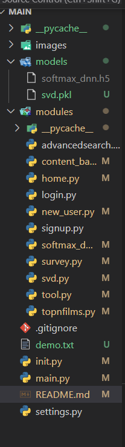

# Task 7: Building Recommender System in Web by Streamlit

## Introduction: 
Firstly, you need to load 2 models: "softmax_dnn.h5" and "svd.pkl" in this link https://drive.google.com/drive/folders/1M2cLwrfGUrAParlYLzMbTBppkbJMn8iC?usp=sharing to folder "models": You can see in the picture below: 

Secondly, you run file init.py

Finally, you go to terminal download some necessary libraries such as streamlit, surprise, ... and run command line "streamlit run main.py"
